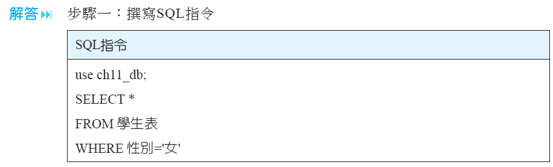

# MySQL語法

## SQL語言提供三種語言

§1.第一種為資料定義語言\(Data Definition Language; DDL\)§用來「定義」資料庫的結構、欄位型態及長度。

§2.第二種為資料操作語言\(Data Manipulation Language; DML\)§用來「操作」資料庫的新增資料、修改資料、刪除資料、查詢資料等功能。

§3.第三種為資料控制語言\(Data Control Language; DCL\)§用來「控制」使用者對「資料庫內容」的存取權利。

§因此，SQL語言透過DDL,DML及DCL來建立各種複雜的表格關聯，成為一個查詢資料庫的標準語言。

##  關鍵字說明

§1. PRIMARY KEY　用來定義某一欄位為主鍵，不可為空值。

§2. UNIQUE　用來定義某一欄位具有唯一的索引值，可以為空值。

§3. NULL/NOT NULL　可以為空值／不可為空值。

§4. FOREIGN KEY　用來定義某一欄位為外來鍵。

##  CREATE TABLE\(建立資料表\)

§\(1\)決定資料表名稱與相關欄位

§\(2\)決定欄位的資料型態§\(3\)決定欄位的限制（指定值域）

§\(4\)決定那些欄位可以NULL\(空值\)與不可NULL的欄位

§\(5\)找出必須具有唯一值的欄位\(主鍵\)

§\(6\)找出主鍵-外來鍵配對\(兩個表格\)

§\(7\)決定預設值\(欄位值的初值設定\)

###  範例

###  分析

§1.辨別「父關聯表」與「子關聯表」。

　　§在利用Create Table來建立資料表時，必須要先了解哪些資料表是屬於父關聯表（一對多，一的那方；亦即箭頭被指的方向）與子關聯表（一對多，多的那方）。

　　§例如：圖中的「學生表」與「課程表」都屬於「父關聯表」。

§2.先建立「父關聯表」之後，再建立「子關聯表」。§例如：圖中的「選課表」屬於「子關聯表」。

###  執行結果

###  【利用SQL實作】再建立「子關聯表」

###  執行結果

###  說明

§【說明1】

　　§在上面中，「選課表」的學號參考「學生表」的學號，如果加入選項ON UPDATE CASCADE與  ON DELETE CASCADE則代表當「學生表」的資料更新與刪除時，「選課表」中被對應的記錄也會一併被異動。

§【說明2】

　　§在上面中，「選課表」的課號雖然參考「課程表」的課號，但是沒有加入選項ON UPDATE CASCADE與  ON DELETE CASCADE，因此，「課程表」中有被「選課表」參考時，則無法進行更新與刪除動作。

##  ALTER TABLE\(修改資料表\)　

###  符號說明

§1. { \| }代表在大括號內的項目是必要項，但可以擇一。

§2. \[ \] 代表在中括號內的項目是非必要項，依實際情況來選擇。

##  DROP TABLE\(刪除資料表\)　

§建立資料表的順序是先建立&lt;父關聯表&gt;，才能建立&lt;子關聯表&gt;，其主要的原因為&lt;子關聯表&gt;參考\(相依於\)&lt;父關聯表&gt;的關係。

§相反地，欲刪除資料表時，則必須要先刪除&lt;子關聯表&gt;，才能刪除&lt;父關聯表&gt;。否則會產生以下的錯誤畫面。

###  分析

§1. 辨別「父關聯表」與「子關聯表」

　　§在利用DROP Table來刪除資料表時，必須要先了解哪些資料表是屬於父關聯表\(一對多，一的那方；亦即箭頭被指的方向\)與子關聯表\(一對多，多的那方\)，例如：上表中的「學生表」與「課程表」。

§2. 先刪除「子關聯表」之後，再建立「父關聯表」

　　§例如：上表中的「選課表」。

##  SQL的DML指令介紹

§資料操作語言\(Data Manipulation Language; DML\)，利用DML，使用者可以從事對資料表記錄的新增、修改、刪除及查詢等功能。

§DML有四種基本指令：

§1.  INSERT\(新增

\)§2.  UPDATE\(修改\)

§3.  DELETE\(刪除\)

§4.  SELECT\(查詢\)

##  INSERT（新增記錄）指令

§假設現在想要新增第一筆記錄到「學生表」中。其記錄內容如下表：

§假設現在想要新增第二筆記錄到「學生表」中。其記錄內容如下：

§假設現在想要新增第3~5筆記錄到「學生表」中。其記錄內容如下表：

 新增來源為另一個資料表

##  UPDATE（修改記錄）指令

###  條件式更新

§將尚未填入「電話」號碼的「S002」學號設定為'2222222'。

###  執行結果

###  同時更新多個欄位資料

 在「課程表」中「資料結構」的學分數改為'4'，並且必選修改為'必'。

###  利用運算式更新

§在「選課表」中「成績」低於70分者，將調高20%。

###  執行結果

###  DELETE（刪除記錄）指令

§把合乎條件的值組（記錄），從資料表中刪除。

§將「學生表old」中的「十全」學生記錄刪除。

###  SELECT指令簡介

###  範例

§找出「學生表」表中，「性別」是「女」的學生記錄。

###  執行結果

##  SQL的DCL指令介紹

§定義：

　　§資料控制語言（Data Control Language；DCL）

　　§DCL控制使用者對資料庫內容的存取權利。

§指令：

　　§1. GRANT（授權）

　　§2. REVOKE（移除權限）

###  GRANT指令

§定義：GRANT指令用來取得現有資料庫使用者帳號的權限。

###  REVOKE指令

§定義：REVOKE指令用來取消資料庫使用者已取得的權限。

